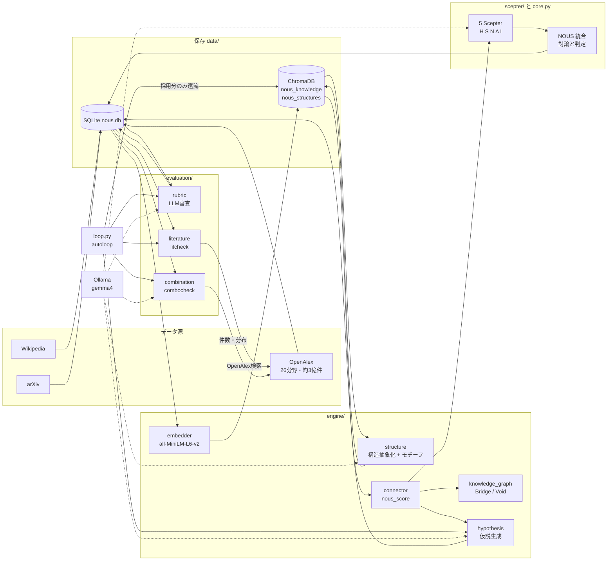
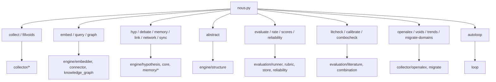
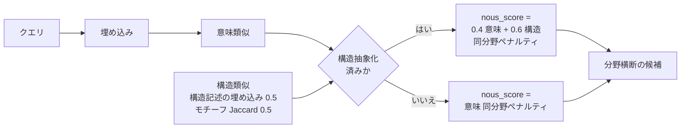
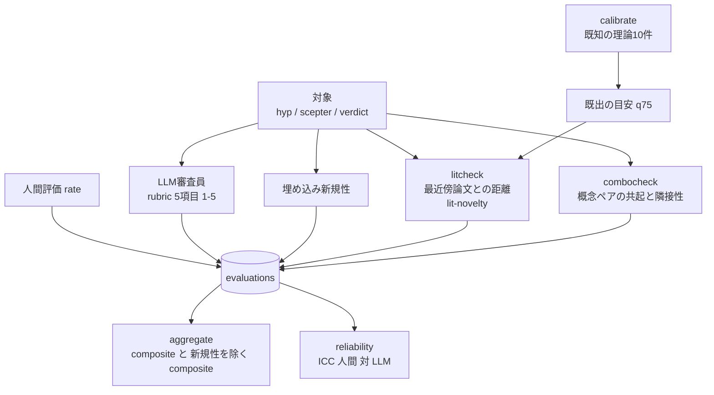
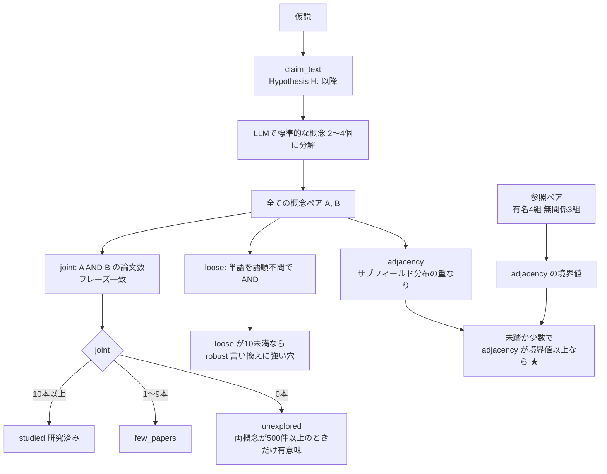
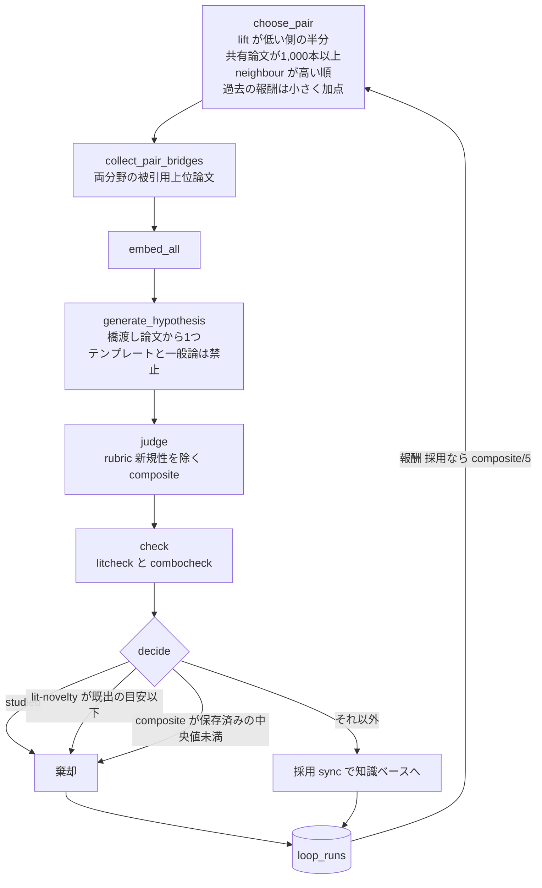
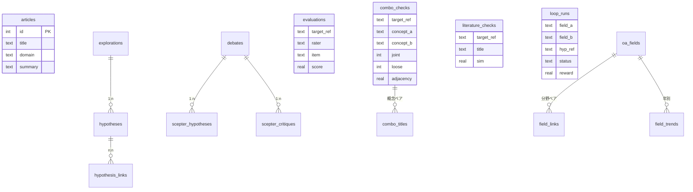
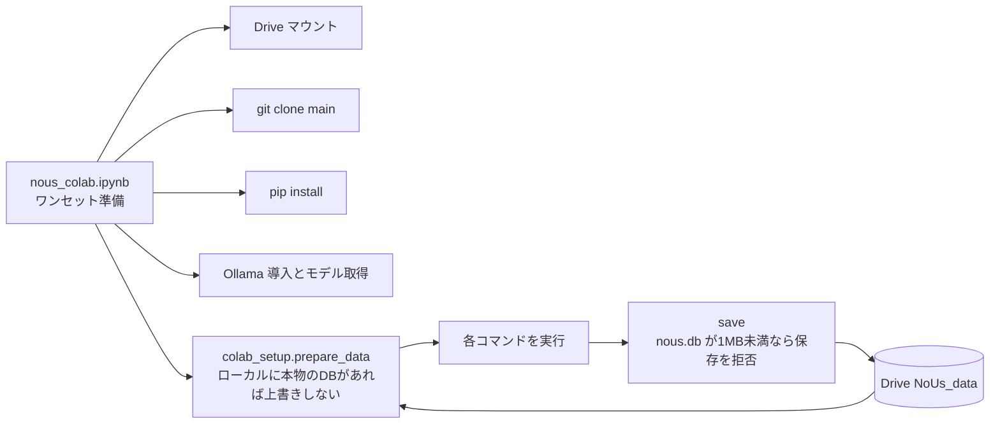

# NoUs アーキテクチャ

コード（`main`）を読んで書いた構成図。図は GitHub 上でそのまま表示される（Mermaid）。
実装の詳細は各ファイル先頭の docstring、運用の手順は `README.md` を参照。

## 1. 全体の流れ

## 2. コマンドと担当モジュール

## 3. 知識ベースと接続（`nous_score`）

## 4. 評価パイプライン

rubric の項目: novelty / testability / specificity / coherence / structural_depth。
LLM の novelty は人間評価より甘く相関もなかったため（n=10）、`loop.py` の報酬には使わない。

## 5. combocheck

## 6. 自律ループ `autoloop`

「採用」は「これらのチェックでは既存文献に見つからなかった」の意味で、新発見の主張ではない。

## 7. データベース

他に `structures`（構造記述）、`literature_controls`（較正用の既知理論）、`combo_meta`（隣接性の境界値）がある。
`target_ref` は `hyp:<id>` / `scepter:<id>` / `verdict:<id>` の形。

## 8. Colab での運用

## 9. 既知の限界

- 文献チェックは、題名と要旨の語の一致と、埋め込みの距離に基づく。「未踏」は「検索で見つからなかった」の意味で、価値の保証ではない。
- 仮説の生成と評価に使う LLM は小さいモデル（既定は `gemma4:e2b`）。LLM 審査員は同一モデルの視点違いで独立ではない。
- 知識ベースは約570記事と小さく、分野ごとの偏りがある。
